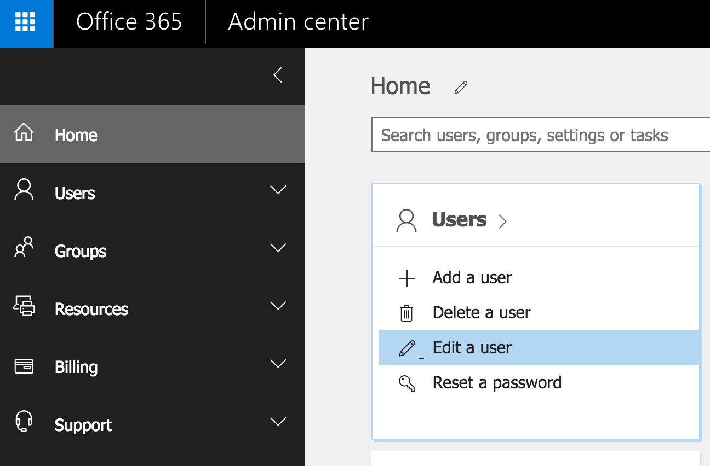
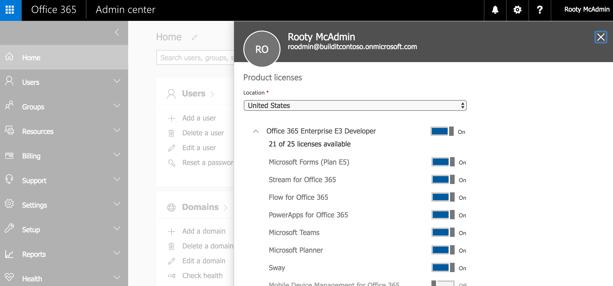
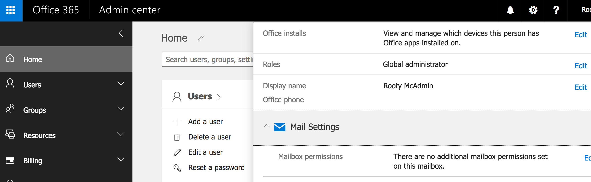
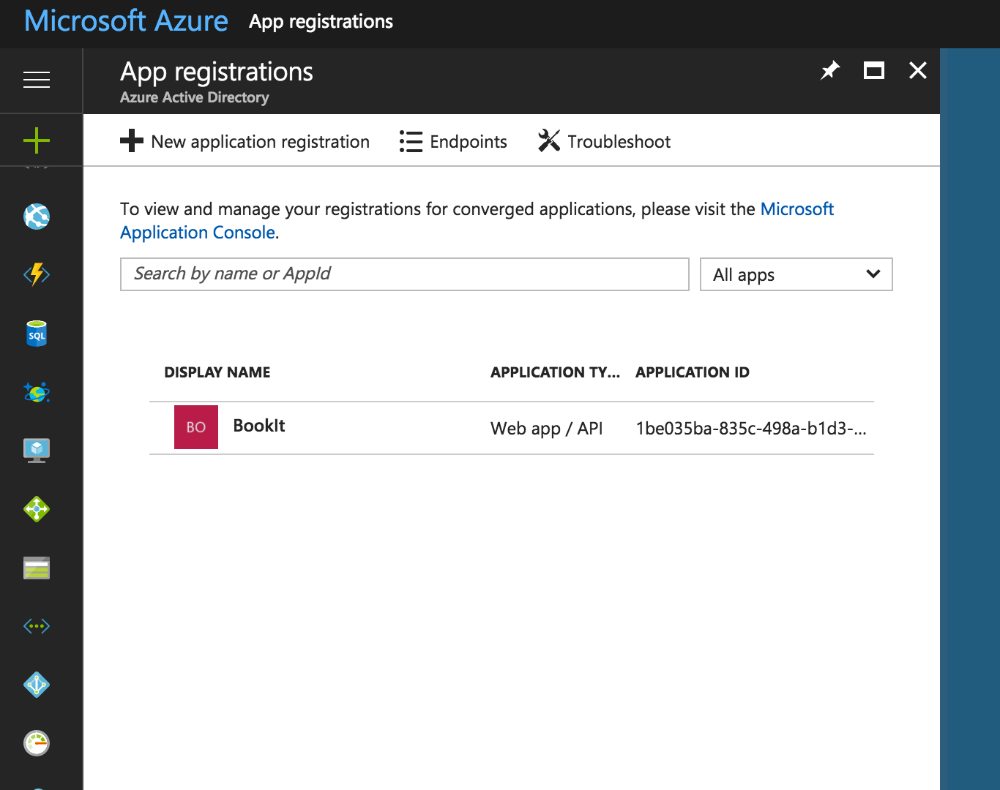
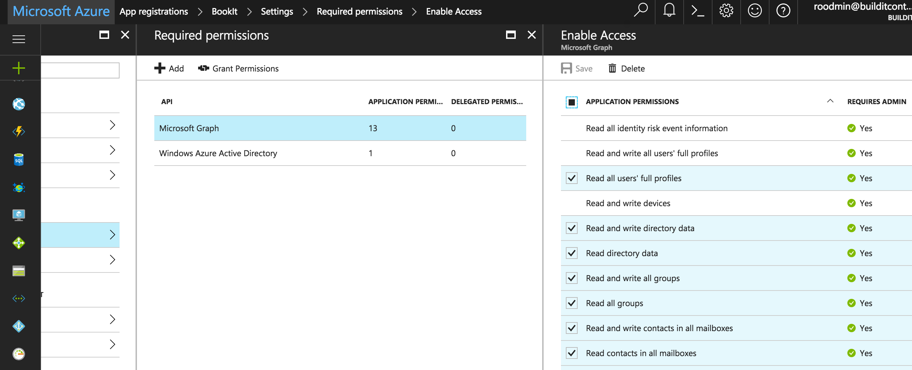

# Setting up Microsoft Azure

## Create a service user that will interact with the MS services on Bookit's behalf.
Go to the MS Office 365 admin panel. Create a user. 

"Install" the MS Office apps for the service user.

Confirm that the apps were installed. The user management screen should show that the service user has an active mailbox and Office apps are installed.

## Set permissions for the Bookit app
Bookit requires a certain set of permissions to be configured in Microsoft Azure AD. 

Go to the portal for managing Azure apps: https://portal.azure.com/#blade/Microsoft_AAD_IAM/ApplicationsListBlade 

Navigate to the "Required Permissions" panel:

 
Azure permissions: 

- "Read and write contacts in all mailboxes" 
- "Read contacts in all mailboxes"

