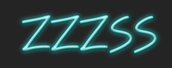

# zzzss

## Usage

The consumable styles are found in `dist`.

You can pull this into your project in any number of ways. To see how we're doing it in a React project, check out [Style Guide](https://github.com/BillyZac/style-guide/).

## For ZZZSS developers
If you want to work on the ZZZSS library, here are some tips and guidelines.

### Deployment
We're using Jenkins to handle continuous deployment. See the Jenkinsfile. Right now, it's very basic. It pulls in the latest code and attempts to publish it to npm's registry.

The publish only happens on tagged commits. Use npm's 'version' command to do the version tags. Here's a sample workflow:

Do some work. Commit it:
```
git add .
git commit -m "Fix bug"
```

If this work is worthy of a version bump, [bump it](https://docs.npmjs.com/cli/version):
```
npm version patch -m "Fix bug"
```

We're using pre and post version hooks (see package.json) to validate and push the code to the remote repo.

Jenkins is configured to run the job whenever a new commit is pushed to ZZZSS's remote repository. At that point, the new version will be published to npm, and any project that depends on ZZZSS will be able to make use of the updated code.
